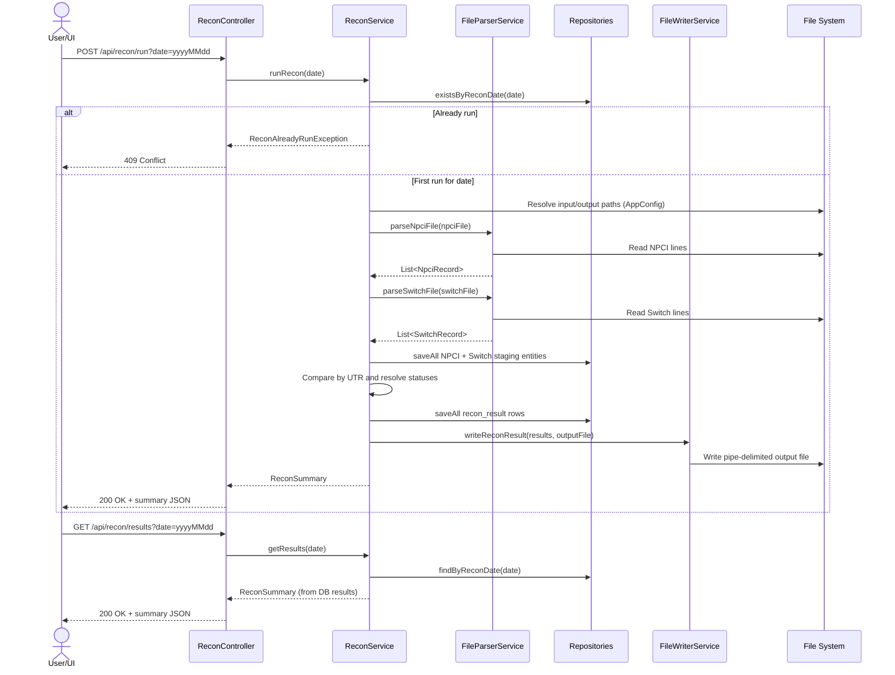

# Reconciliation Diagrams

This document provides visual diagrams for the end-to-end reconciliation process.
 
## End-to-End Flow

```mermaid
flowchart TD
    A[User / Scheduler triggers run<br/>POST /api/recon/run?date=yyyyMMdd] --> B[ReconController]
    B --> C[ReconService.runRecon(date)]
    C --> D{Results already exist<br/>for date?}
    D -- Yes --> E[Throw ReconAlreadyRunException<br/>HTTP 409]
    D -- No --> F[Resolve file paths from AppConfig]
    F --> G[Read NPCI input file]
    F --> H[Read Switch input file]
    G --> I[FileParserService.parseNpciFile]
    H --> J[FileParserService.parseSwitchFile]
    I --> K[Persist NPCI staging rows]
    J --> L[Persist Switch staging rows]
    K --> M[Build UTR maps + union keys]
    L --> M
    M --> N[Resolve status per UTR<br/>MATCHED / MISMATCH / MISSING]
    N --> O[Persist recon_result rows]
    O --> P[Write RECON_RESULT output file]
    P --> Q[Return ReconSummary response]
```

## Sequence Diagram (Run + Read Results)



