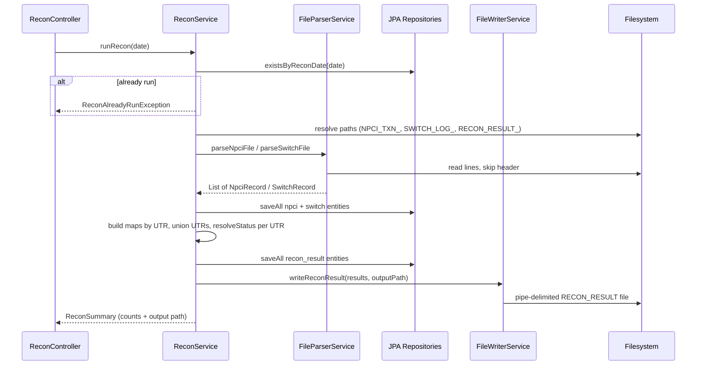

# Reconciliation — end-to-end flow

This document describes how the Spring Boot app loads NPCI and Switch files, compares them by **UTR**, assigns a **recon status**, persists rows to PostgreSQL, and writes the pipe-delimited **RECON_RESULT** file.

---

## 1. Entry points

| HTTP | Handler | Service method | Purpose |
|------|---------|----------------|---------|
| `POST /api/recon/run?date=yyyyMMdd` | `ReconController.runRecon` | `ReconService.runRecon(LocalDate)` | Run recon for one business date: parse files, compare, DB + file output |
| `GET /api/recon/results?date=yyyyMMdd` | `ReconController.getResults` | `ReconService.getResults(LocalDate)` | Read prior results from DB only (no file read) |

Date format is `yyyyMMdd` (e.g. `20240101`). Exceptions from missing files or duplicate runs are mapped by `GlobalExceptionHandler` (404 for missing input file, 409 if recon already exists for that date).

---

## 2. High-level sequence

---

## 3. `ReconService.runRecon` — step by step

Implementation: `com.bank.recon.service.ReconService`.

1. **Idempotency guard**  
   `reconResultRepository.existsByReconDate(date)` — if true, throws `ReconAlreadyRunException`.

2. **Resolve paths** (from `AppConfig`, wired from `application.yml` under `recon.file`):  
   - NPCI: `{npci-path}/NPCI_TXN_{yyyyMMdd}.{ext}` — `{ext}` from `recon.file.extension` (default `dat`)  
   - Switch: `{switch-path}/SWITCH_LOG_{yyyyMMdd}.{ext}`  
   - Output: `{output.path}/RECON_RESULT_{yyyyMMdd}.{ext}`  
   Defaults are `data/input/npci`, `data/input/switch`, `data/output` (override with `RECON_NPCI_PATH`, `RECON_SWITCH_PATH`, `RECON_OUTPUT_PATH`).

3. **Parse inputs**  
   - `fileParserService.parseNpciFile(npciFile)` → `List<NpciRecord>`  
   - `fileParserService.parseSwitchFile(switchFile)` → `List<SwitchRecord>`

4. **Persist source transactions**  
   - NPCI rows → `NpciTransaction` via `toEntity` → `npciTransactionRepository.saveAll(...)`  
   - Switch rows → `SwitchLog` via `toEntity` → `switchLogRepository.saveAll(...)`

5. **Join for comparison**  
   - Two maps: `npciByUtr` and `switchByUtr` (`LinkedHashMap`, last wins if duplicate UTR in same file).  
   - `TreeSet<String> utrs` = union of all UTR keys (sorted iteration order).

6. **Per-UTR reconciliation**  
   For each UTR in `utrs`:  
   - Look up `NpciRecord` and `SwitchRecord` (nullable).  
   - `resolveStatus(npci, sw)` → `ReconStatus` (code + remarks).  
   - Append `ReconResultRecord(utr, npci amount, switch amount, npci status, switch status, recon code, remarks)`.

7. **Persist + file output**  
   - `reconResultRepository.saveAll(...)` mapping each `ReconResultRecord` to `ReconResult`.  
   - `fileWriterService.writeReconResult(results, outputFile)`.

8. **API response**  
   `toRunSummary(...)` builds `ReconSummary` with input counts, category counts, output file path, status `COMPLETED`.

---

## 4. Input parsing (`FileParserService`)

- Reads the whole file as UTF-8 lines.  
- **Skips line 0** (header); data starts at line index `1`.  
- Each data line: `split("\\|", -1)` — pipe-separated, empty trailing fields preserved.  
- **NPCI** (`parseNpciFile`): columns map into `NpciRecord` (UTR, RRN, txn date/time, amount as `BigDecimal`, payer/payee VPA, status — indices 0–7 in code).  
- **Switch** (`parseSwitchFile`): same split pattern into `SwitchRecord` (UTR, RRN, dates, amount, status, response code, switch ref).  
- Blank tokens become `null`; amounts parsed with `new BigDecimal(...)`.

---

## 5. What is used for comparison?

| Aspect | Mechanism |
|--------|-----------|
| **Join key** | **UTR** string — one row per UTR in the union of both sides. |
| **Amount** | `BigDecimal.compareTo` — equal only if both non-null and `compareTo == 0` (exact decimal equality as parsed). |
| **Status** | `String.equals` — both must be non-null and identical after trim/null handling from parsing. |
| **Ordering of checks** | Implemented in `resolveStatus` (strict sequence below). |

---

## 6. Reconciliation logic (`resolveStatus`)

For each UTR, `ReconService.resolveStatus(NpciRecord npci, SwitchRecord sw)` returns a **sealed** `ReconStatus` implementation with `code()` and `remarks()`:

| Order | Condition | Result type | `code()` |
|-------|-----------|-------------|----------|
| 1 | NPCI present, Switch absent | `SwitchMissing` | `SWITCH_MISSING` |
| 2 | NPCI absent (implies Switch present*) | `NpciMissing` | `NPCI_MISSING` |
| 3 | Both present, amounts differ | `AmountMismatch` | `AMOUNT_MISMATCH` |
| 4 | Both present, statuses differ | `StatusMismatch` | `STATUS_MISMATCH` |
| 5 | Else (both present, amount + status match) | `Matched` | `MATCHED` |

\* After step 1, “NPCI absent” means only Switch has the UTR.

**Remarks:**  
- `Matched`: fixed text `"All fields match"`.  
- `SwitchMissing` / `NpciMissing`: fixed explanatory strings.  
- `AmountMismatch` / `StatusMismatch`: dynamic text built in `resolveStatus` (e.g. `"Amount differs: NPCI=… Switch=…"`).

Helper methods: `amountMatches`, `stringMatches`, `fmt` (amounts formatted to 2 decimal places for remarks).

---

## 7. How output is generated

### 7.1 File (`FileWriterService.writeReconResult`)

- Ensures parent directory exists (`Files.createDirectories`).  
- First line: fixed header  
  `UTR|NPCI_AMOUNT|SWITCH_AMOUNT|NPCI_STATUS|SWITCH_STATUS|RECON_STATUS|REMARKS`  
- Each row: same columns, `|` joined; nulls rendered as `--`; amounts scaled to 2 decimal places (`HALF_UP`).  
- Written with UTF-8 to `RECON_RESULT_{yyyyMMdd}.{ext}` (see `recon.file.extension`).

### 7.2 Database

- **Staging**: `npci_transaction`, `switch_log` (per-ingestion rows, keyed by entity IDs + `recon_date` on entities).  
- **Outcome**: `recon_result` stores one row per UTR for that `recon_date` with both sides’ amounts/statuses, `recon_status`, and `remarks`.  
- Schema is validated by Hibernate against `schema.sql` / entities (`ddl-auto: validate`).

### 7.3 API summary (`ReconSummary`)

After a run, the JSON summary includes input file counts, counts per recon category (`matched`, `switchMissing`, `npciMissing`, `amountMismatch`, `statusMismatch`), and the output file path string.  
`getResults` recomputes category counts from stored `recon_result` rows (input counts set to 0 in that path).

---

## 8. Supporting components

| Component | Role |
|-----------|------|
| `ReconApplication` | Boots Spring, scans `@ConfigurationProperties`, sets default JVM timezone to `Asia/Kolkata`. |
| `AppConfig` (`recon.file`) | Supplies input/output directory paths. |
| `GlobalExceptionHandler` | Maps `FileNotFoundException`, `ReconAlreadyRunException`, and generic errors to HTTP responses. |

This is the full programmatic path from HTTP trigger through parsing, UTR-based comparison rules, persistence, and pipe-delimited report generation.
