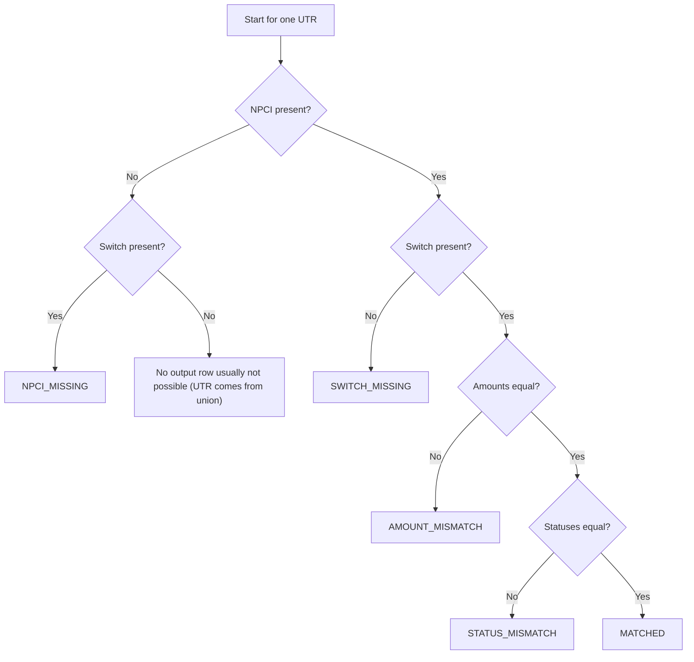

# Reconciliation Logic

This document explains exactly how reconciliation status is decided for each transaction.

## 1) Core idea

- The system compares **NPCI** and **Switch** records using **UTR** as the join key.
- For a given run date, all UTRs from both files are collected.
- For each UTR, a single final `recon_status` is assigned based on ordered rules.

## 2) Data used for comparison

- **Join key:** `UTR`
- **Amount comparison:** NPCI amount vs Switch amount (`BigDecimal.compareTo == 0`)
- **Status comparison:** NPCI status vs Switch status (string equality)

## 3) Rule order (important)

Rules are applied in this exact sequence. First match wins.

1. **Switch Missing**  
   - Condition: NPCI exists, Switch does not exist  
   - Output: `SWITCH_MISSING`

2. **NPCI Missing**  
   - Condition: Switch exists, NPCI does not exist  
   - Output: `NPCI_MISSING`

3. **Amount Mismatch**  
   - Condition: both exist, but amount differs  
   - Output: `AMOUNT_MISMATCH`

4. **Status Mismatch**  
   - Condition: both exist, amount matches, but status differs  
   - Output: `STATUS_MISMATCH`

5. **Matched**  
   - Condition: both exist, amount matches, and status matches  
   - Output: `MATCHED`

## 4) Decision flow diagram



## 5) Pseudocode

```text
for each utr in union(npciUtrs, switchUtrs):
    npci = npciByUtr[utr]
    sw = switchByUtr[utr]

    if npci != null and sw == null:
        status = SWITCH_MISSING
    else if npci == null and sw != null:
        status = NPCI_MISSING
    else if npci.amount != sw.amount:
        status = AMOUNT_MISMATCH
    else if npci.status != sw.status:
        status = STATUS_MISMATCH
    else:
        status = MATCHED
```

## 6) Output generated per UTR

Each reconciled row contains:

- `UTR`
- `NPCI_AMOUNT`
- `SWITCH_AMOUNT`
- `NPCI_STATUS`
- `SWITCH_STATUS`
- `RECON_STATUS`
- `REMARKS`

These rows are saved to DB and also written to the `RECON_RESULT` output file.

## 7) Example outcomes

- UTR present only in NPCI -> `SWITCH_MISSING`
- UTR present only in Switch -> `NPCI_MISSING`
- UTR present in both, amount differs -> `AMOUNT_MISMATCH`
- UTR present in both, amount same but status differs -> `STATUS_MISMATCH`
- UTR present in both, amount and status same -> `MATCHED`

